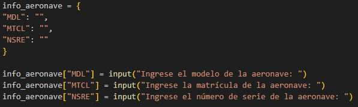
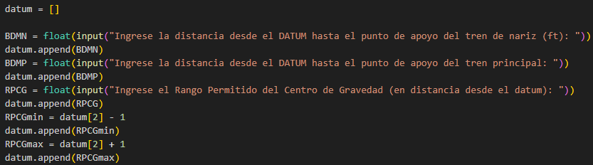

## Reto Unidad 4: Estructuras de Datos.

El objetivo de este reto es aplicar los conocimientos adquiridos a lo largo de la Unidad 4 del curso de programación. En esta unidad, se dieron a conocer las diferentes estructuras de datos que existen, tales como tuplas, listas y diccionarios.

En este documento, se describe cuál va a ser el código a modificar de la unidad anterior, dónde se va a modificar y cómo podría servir la estructura de datos en el código. 

### Descripción General. 

+ **Opción a modificar:** Opción 2 "Pesaje y Centro de Gravedad de una Aeronave."

+ **Estructuras de datos a usar:** Listas y diccionarios. (Se puede usar otro tipo de estructuras vistas en clase según las necesidades.)

+ **Objetivo de la modificación:** 
Permitir almacenar y gestionar datos de manera eficiente. Los datos incluyen las constantes, como por ejemplo la distancia entre el *Main Landing Gear*, *Nose Landig Gear* y el dátum. También la distancia a la que se debe encontrar el Centro de Gravedad y el peso necesario para que esté acorde con el manual de la aeronave y no se exceda el MTOW (*Maximun Take Off Weight*). Además de las constantes, también vamos a usar datos de tipo *srt*, que se usaron dentro del código para definir datos generales de la aeronave, tales como el modelo, la matrícula y el número de serie. Será muy eficiente utilizar este tipo de datos en los diccionarios, para posteriormente hacer un reporte final de peso y balance.

### Procedimiento.
A continuación se define el paso a paso utilizado para realizar la modificación:

1. **Definir qué estructuras de datos:** En primer lugar y teniendo en cuenta los requerimientos del reto y las estructuras de datos vistas en clase, se eligió aplicar diccionarios y listas en la modificación del código.

2. **Definir el problema:** En segundo lugar, analizamos qué problema era más conveniente, según la cantidad y tipo de datos que se usaran en el código. En este caso, se optó por la opción 2. 

3. **Creación de diccionarios y listas:** El siguiente paso fue crear las listas y los diccionarios dentro del código, haciendo que los datos que anteriormente estaban "sueltos estuvieran ahora dentro de una estructura de datos. Para ello, usamos todos nuestros conocimientos en la sintaxis de Phyton.

4. **Modificación sintaxis anterior:** Como se hicieron cambios en los datos que usaba el problema para ser ejecutado, también era necesario hacer un cambio y hacer que tomara los valores en las nuevas ubicaciones. Para eso usamos las posiciones de las listas y las claves de los diccionarios.

5. **Verificación de funcionamiento:** Para finalizar, verificamos que el código nuevo (el que ahora incluye las listas y los diccionarios) funcionaba, y en efecto lo hizo.

### Diccionarios, Listas y Datos.
En esta sección se definen cuáles fueron los diccionarios y las listas creadas, así como los datos que contienen. 

+ **Diccionario "info_aeronave":** Se creó este diccionario para almacenar la información general de la aeronave. Incluye los datos MDL, MTCL y NSRE, que hacen referencia al modelo, matrícula y número de serie de la aeronave respectivamente. 

    _Evidencia fotográfica:_

    

+ **Lista "Datum":** Esta lista contiene los datos numéricos de tipo punto flotante _(float)_ que se usan en peso y balance de la aeronave. Incluye las distancias medidas desde el dátum hasta el MLG y NLG, así como el rango de distancia permitido del Centro de Gravedad dado por el fabricante para garantizar la seguridad del vuelo. También se usó el comando _datum.append_ para agregar datos de interés a la lista.

    _Evidencia fotográfica:_
    
    